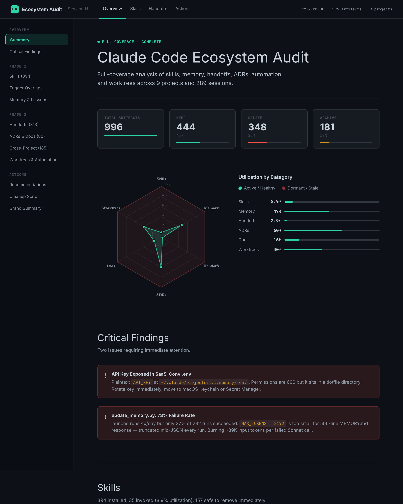

# Claude Code Ecosystem Hygiene

Five complementary skills across two tracks. The **Claude-ecosystem track** (4 plugins) audits, measures, cleans, and keeps consistent your `~/.claude/` stack: identify what's HOT vs DORMANT, measure whether the HOT artifacts actually improve task outcomes, prune what doesn't pull its weight, and keep project docs in sync with the lessons that supersede them. The **project-quality track** (`test-effectiveness-auditor`) applies the same "measure don't guess" discipline to your project's own automated test suite — replays past bugs at pre-fix commits to quantify how many your tests actually catch.

[](LICENSE)
[](https://github.com/wan-huiyan/claude-ecosystem-hygiene/commits)
[](https://claude.com/claude-code)



## The audit → measure → clean → stay-consistent pipeline

```
┌─────────────────┐   ┌──────────────────┐   ┌────────────────┐   ┌───────────────────┐
│ ecosystem-audit │──▶│ claude-code-ab-  │──▶│ memory-hygiene │──▶│ doc-freshness-    │
│                 │   │ harness          │   │                │   │ reverse-lint      │
│ which artifacts │   │ do the HOT ones  │   │ prune what the │   │ catch project     │
│ are HOT vs      │   │ actually improve │   │ harness showed │   │ docs that still   │
│ DORMANT?        │   │ task outcomes?   │   │ adds no value  │   │ contradict the    │
│                 │   │                  │   │                │   │ new lessons       │
│ minutes, $0     │   │ 30min–3hrs, $10+ │   │ minutes, $0    │   │ event-driven, $0  │
└─────────────────┘   └──────────────────┘   └────────────────┘   └───────────────────┘
```

Reference counts are a starting point, not a verdict. `ecosystem-audit` catches DORMANT artifacts cheaply. But a HOT artifact might still be noise — it gets touched and adds nothing. Only the A/B harness can separate "HOT and useful" from "HOT and ritual." When ≥5 tasks show no outcome change under ablation, `memory-hygiene` has a concrete signal to consolidate or delete. Finally, `doc-freshness-reverse-lint` watches memory-file edits for new "don't X" rules and surfaces project docs that still recommend X — the step that prevents your freshly-corrected lessons from being silently undone by stale research notes.

## What's Inside

| Plugin | Stage | What it does |
|--------|-------|--------------|
| [`ecosystem-audit`](plugins/ecosystem-audit/) | **Audit** | Full-coverage audit across 9 artifact categories (skills, memory, handoffs, ADRs, plans, reviews, worktrees, automation, provenance). Parses JSONL session logs for real skill invocation data. Produces interactive HTML report with radar chart and prioritized P0/P1/P2 cleanup actions. |
| [`ab-harness`](plugins/ab-harness/) | **Measure** | Counterfactual A/B + layered-ablation harness. Runs each task twice (setup-ON vs setup-OFF) or strips one layer at a time from a full baseline, then reports turns, tool calls, cost, and pitfall-keyword hits. **Heavyweight: $10–$80, 30min–3hrs.** Pair with the audit to turn reference-count signals into actual quality measurements. |
| [`memory-hygiene`](plugins/memory-hygiene/) | **Clean** | Deep audit of the persistent knowledge stack: MEMORY.md bloat (200-line threshold), axioms (Cowan cap of 12), lessons deduplication, ADR integrity (MADR 4.0), tier-placement violations, session compression backlog. Grounded in cognitive science (Cowan 2001) and LLM research (Liu et al. 2024). |
| [`doc-freshness-reverse-lint`](plugins/doc-freshness-reverse-lint/) | **Stay consistent** | Event-driven PostToolUse hook + weekly cron that catches project `docs/` contradicting the lessons that supersede them. When you add "don't sort by p-value" to `lessons.md`, the hook greps `docs/research/**` for literal matches and surfaces them as candidate stale claims — file:line only, never auto-edits. Conservative guardrails (explicit negation, multi-token phrase, one phrase per rule, silent on zero hits) prevent false positives on qualified content. |
| [`test-effectiveness-auditor`](plugins/test-effectiveness-auditor/) | **Measure (project tests)** | Quantitatively answers "how many bugs do our tests actually catch?" Mines `docs/findings/`, `docs/issues/`, and git log fix commits, then for each incident checks out the pre-fix SHA in a temp worktree, runs the project's test command, and classifies as `caught` / `gap_testable` / `gap_hard` / `unrunnable`. Sibling 'measure' tool to `ab-harness` — ab-harness measures the Claude stack, this measures your project's own tests. Read-only, never auto-writes tests. Bundled from [`wan-huiyan/test-effectiveness-auditor`](https://github.com/wan-huiyan/test-effectiveness-auditor). |

> **Moved:** `skill-trigger-eval-subprocess-blindness` lived here in v1.0.0 but has been
> relocated to [`wan-huiyan/claude-skill-authoring`](https://github.com/wan-huiyan/claude-skill-authoring)
> where it sits alongside other skill-authoring tools. Update your install if you had it.

## Quick Start

```
you: i've been using claude code for a couple months and my ~/.claude folder
     feels bloated. can you audit and tell me what to clean up?

claude: *triggers ecosystem-audit*
        → parses 291 session JSONL files → 35 skills invoked out of 394 installed
        → checks memory via memory-hygiene thresholds → MEMORY.md 506 lines (bloated)
        → classifies 313 handoffs → 167 worktree duplicates identified
        → generates interactive HTML report with radar chart
        → writes cleanup script as P0 action

you: *opens docs/handoffs/ecosystem_audit_report.html*
     sees 8.9% skill utilization, 147 niche-dormant skills safe to uninstall.
     wonders: of the 35 invoked skills, which ones actually improve answers?

claude: *triggers ab-harness*
        → validates CLAUDE_CONFIG_DIR=/tmp/claude-empty probe
        → runs 3 hand-picked tasks twice each on setup-ON vs setup-OFF
        → mines session JSONLs for turns, cost, pitfall keywords
        → on n=3: setup prevented 1 of 3 pitfalls (33%), no turn savings
        → recommends layered ablation next for per-layer attribution

you: ok, now i know which layers earn their keep. what do i actually delete?

claude: *triggers memory-hygiene*
        → consumes the ranked layer-contribution list from the harness
        → flags the 8 zero-Δ layers as consolidation candidates
        → applies Cowan cap, MEMORY.md 200-line threshold, lesson dedup
```

## Installation

### Install all five (recommended)

```bash
claude plugin marketplace add wan-huiyan/claude-ecosystem-hygiene
claude plugin install ecosystem-audit@claude-ecosystem-hygiene
claude plugin install ab-harness@claude-ecosystem-hygiene
claude plugin install memory-hygiene@claude-ecosystem-hygiene
claude plugin install doc-freshness-reverse-lint@claude-ecosystem-hygiene
claude plugin install test-effectiveness-auditor@claude-ecosystem-hygiene
```

### Install individually via git

```bash
git clone https://github.com/wan-huiyan/claude-ecosystem-hygiene.git /tmp/ceh
cp -r /tmp/ceh/plugins/ecosystem-audit ~/.claude/skills/
cp -r /tmp/ceh/plugins/ab-harness ~/.claude/skills/
cp -r /tmp/ceh/plugins/memory-hygiene ~/.claude/skills/
cp -r /tmp/ceh/plugins/doc-freshness-reverse-lint ~/.claude/skills/
cp -r /tmp/ceh/plugins/test-effectiveness-auditor ~/.claude/skills/
```

> **`doc-freshness-reverse-lint` needs a hook** to trigger automatically. After
> install, add the one-line `PostToolUse` hook from its
> [README](plugins/doc-freshness-reverse-lint/README.md#hook-wiring-required-for-event-driven-mode)
> to your `~/.claude/settings.json`. Without the hook, it still runs on demand
> via the weekly audit script — you just lose the event-driven surfacing.

> **Note:** `memory-hygiene` is also available as a standalone repo at
> [`wan-huiyan/memory-hygiene`](https://github.com/wan-huiyan/memory-hygiene), and
> `test-effectiveness-auditor` is also available standalone at
> [`wan-huiyan/test-effectiveness-auditor`](https://github.com/wan-huiyan/test-effectiveness-auditor).
> Installing from either source yields the same skill. Use this bundle if you want them
> alongside the audit and A/B harness; use the standalone repos if you only want one.

## How They Fit Together

```
┌─────────────────────────────────────────────────────────────┐
│  ecosystem-audit               Scope: the WHOLE ecosystem   │
│    ├─ parses JSONL session logs for skill usage             │
│    ├─ calls memory-hygiene thresholds inline                │
│    ├─ scans handoffs, ADRs, worktrees, automation           │
│    └─ produces interactive HTML with radar chart            │
├─────────────────────────────────────────────────────────────┤
│  ab-harness        Scope: outcome measurement   │
│    ├─ CLAUDE_CONFIG_DIR clean-env mechanism                 │
│    ├─ binary A/B (setup-ON vs setup-OFF)                    │
│    ├─ 12-cell layered ablation (strip one layer at a time)  │
│    └─ ranked contribution list feeds back into pruning      │
├─────────────────────────────────────────────────────────────┤
│  memory-hygiene                Scope: persistent knowledge  │
│    ├─ MEMORY.md bloat (>200 lines = truncation risk)        │
│    ├─ axioms cap (Cowan 2001 = 12 items max)                │
│    ├─ lessons dedup + tier placement                        │
│    ├─ ADR integrity (MADR 4.0 compliance)                   │
│    └─ codebase contradiction detection                      │
├─────────────────────────────────────────────────────────────┤
│  doc-freshness-reverse-lint    Scope: project docs/ ↔ memory│
│    ├─ PostToolUse hook on lessons.md / axioms.md / feedback │
│    ├─ extracts negated "don't X" phrase                     │
│    ├─ greps docs/{research,decisions,findings,runbooks}/    │
│    ├─ surfaces candidate stale claims via hookOutput        │
│    └─ weekly cron audit as safety net                       │
├─────────────────────────────────────────────────────────────┤
│  test-effectiveness-auditor    Scope: your project's tests  │
│    ├─ mines docs/findings + git log fix|bug|revert|hotfix   │
│    ├─ checks out pre-fix SHA in temp worktree per incident  │
│    ├─ runs the project test command, parses pass/fail       │
│    ├─ classifies caught / gap_testable / gap_hard / unrunna │
│    └─ Method 2: gh actions / gcloud builds CI history       │
└─────────────────────────────────────────────────────────────┘
```

Run `ecosystem-audit` to see the big picture of your `~/.claude/`. Point `ab-harness` at the HOT artifacts it flagged to see which ones actually change task outcomes. When the harness or the audit flags memory issues, drop into `memory-hygiene` for concrete fixes. Once a new lesson lands, `doc-freshness-reverse-lint` catches any project docs that still recommend the retracted approach — closing the loop so future sessions don't re-learn the wrong thing. Separately, when you want the same "measure don't guess" rigor applied to your project's own automated tests, run `test-effectiveness-auditor` — it replays past bugs at pre-fix commits and tells you which ones the suite would have caught. For skill-authoring tooling (including the subprocess-blindness diagnostic), see [`claude-skill-authoring`](https://github.com/wan-huiyan/claude-skill-authoring).

## What to do with A/B harness results

The A/B harness emits a ranked layer-contribution list — e.g., on one real run
(see [`plugins/ab-harness/examples/layered_ablation_example.md`](plugins/ab-harness/examples/layered_ablation_example.md))
only 2 of 10 ablated layers had measurable pitfall-prevention loss at n=1.
The other 8 were zero-delta strips. That's the signal `memory-hygiene` is
designed to consume:

- **Δ pitfalls = 0 AND Δ cost > 0 when stripped** → layer adds cost without catching anything on the measured task set. Candidate for consolidation.
- **Δ pitfalls < 0** → layer earned its keep. Keep (or invest more in it).
- **Δ pitfalls = 0 AND Δ cost ≤ 0 when stripped** → layer costs nothing to keep but didn't provably help either. Leave alone, re-evaluate next audit.

Remember the limitations: n=1 rankings tie within noise below the top two slots, and the task set upward-biases pitfall-prevention. Use the harness as evidence for pruning decisions, not proof.

## What You Get

When you ask Claude to audit your ecosystem, you get:

- **Markdown report** at `docs/handoffs/ecosystem_audit_report.md` with summary tables and cleanup actions
- **Interactive HTML report** at `docs/handoffs/ecosystem_audit_report.html` featuring:
  - Radar chart showing health % across 6 axes (skills, memory, handoffs, ADRs, docs, worktrees)
  - Sortable tables per category
  - Priority-coded action cards (P0 red, P1 amber, P2 blue)
  - Ready-to-run cleanup script in a code block
- **Cleanup script** ready to paste into your terminal

## Without These Skills vs With

| Question | Without | With |
|----------|---------|------|
| "Which skills am I actually using?" | `ls ~/.claude/skills \| wc -l` — you get the install count, not usage | Parse JSONL logs → "35 invoked out of 394 in last 30 days (8.9%)" |
| "Is my memory bloated?" | Open MEMORY.md, eyeball it | `wc -l` against thresholds: bloated >200, target ~40 |
| "Are my handoffs stale?" | Manually scan `docs/handoffs/` | Classify as Current/Historical/Orphaned with counts per project |
| "Are my worktrees healthy?" | `git worktree list` — see paths, not staleness | Lifecycle score (EXPECTED / ACCEPTABLE / NEEDS_CLEANUP / ABANDONED) |
| "Do our project's tests actually catch bugs?" | `pytest --cov` — coverage % is a proxy, not catch rate | Replay 5–10 documented bugs at pre-fix commits; report N caught / M gaps with a prioritised gap backlog |

## Decision Criteria

Thresholds in **bold** are grounded in published sources.
Thresholds in *italic* are practitioner heuristics — adjust for your domain.

| Metric | Threshold | Source |
|--------|-----------|--------|
| MEMORY.md bloat | **>200 lines = truncation risk** | Claude Code platform limit |
| Axioms count | **12 items max** | [Cowan (2001)](https://doi.org/10.1017/S0140525X01003922) — working memory capacity |
| Position decay in long context | **>30% accuracy loss mid-context** | [Liu et al. (2024) TACL](https://arxiv.org/abs/2307.03172) |
| Skill utilization threshold | *<10% = worth pruning* | Practitioner heuristic |
| Worktree "abandoned" | *unmerged + >14 days* | Practitioner heuristic |
| Session compression | *>30 days + >50 lines + unreferenced* | memory-hygiene convention |

## Limitations

- **Session log scope.** Only skills invoked via the `Skill()` tool show up in the usage analysis. Skills invoked through slash commands (`/causal-impact-campaign`) appear the same as interactive triggers, but anything bypassing the Skill tool (e.g., direct file reads of a SKILL.md) won't be counted.
- **No monthly automation.** The audit runs on demand. There's no built-in cron — if you want it scheduled, combine with the `schedule` skill.
- **Worktree lifecycle scoring is age-based.** A "hot" worktree on a 20-day-old branch that's actively being committed to gets scored as ABANDONED. The metric favors conventional workflows.
- **HTML template styling is opinionated.** The dark terminal theme (GitHub-dark background, Fira Code headings, teal accent) is intentional. Rewrite the template if you want a different aesthetic.
- **Not a replacement for `schliff:doctor` or individual skill tooling.** This bundle covers ecosystem-level breadth. For per-skill structural quality, pair with [schliff](https://github.com/Zandereins/schliff).

## Related Skills

- **[schliff](https://github.com/Zandereins/schliff)** — Per-skill structural quality scoring on 7 dimensions. Runs after ecosystem-audit identifies dormant skills to assess if they're worth keeping.
- **[skill-portfolio-audit](https://github.com/wan-huiyan/skill-portfolio-audit)** — Portfolio-wide README/badge standardization. Run after cleanup to polish remaining skills.
- **[session-handoff](https://github.com/wan-huiyan/session-handoff)** — Creates the handoff docs that this bundle audits.
- **[skill-sync](https://github.com/wan-huiyan/skill-sync)** — Keeps published skills in sync with their GitHub repos.

## Quality Checklist

<details>
<summary>What this bundle guarantees</summary>

- [x] **No client data in any published artifact.** All examples use synthetic SaaS/retail domain names.
- [x] **Canonical plugin layout.** `marketplace.json` in `.claude-plugin/`, plugin manifests in `plugins/<name>/.claude-plugin/plugin.json`, source paths start with `./plugins/`.
- [x] **Per-plugin version tracking.** Each plugin has independent `version` in `plugin.json` and marketplace entry.
- [x] **MIT licensed.** Free to fork, modify, and redistribute.
- [x] **Published thresholds are cited.** Cowan, Liu et al., and platform limits link to sources. Heuristics are labeled as such.
- [x] **HTML report is self-contained.** No external CDN dependencies, works offline after initial font load.
- [x] **JSONL parsing tested on 291 real sessions** (~35 skills, ~226 invocations, all projects).

</details>

## Version History

- **v1.6.0** (2026-04-25) — **`ecosystem-audit` bumped to v1.2.0** (layered-ablation v3 alignment). New Phase 2.5 step annotates each radar axis with a noise-floor tier (T1 / T1.5 / T2 / T3 / T?) backed by `claude-code-ab-harness` v1.2.0+ output — reference count alone no longer determines tier. Skills axis gains a correctness-vs-latency overlay: positive A/B signal on pitfall-prone tasks but signed Δ-turns / Δ-$ on uncovered tasks (per v3 finding L-AB-11). New "Skills with Mismatched Trigger Surface" report section flags HOT skills whose specialty does not match the user's recurring pitfalls; the recommendation engine no longer blanket-recommends "install more skills." When the harness has not been run, tiers render as `T?` with stated-uncertainty rather than fabricated values. ~80 lines added across SKILL.md + scripts/score_health.py.
- **v1.5.0** (2026-04-24) — **Added `test-effectiveness-auditor` v1.0.0** as the project-quality measurement track. Sibling 'measure' tool to `ab-harness`: ab-harness measures whether your Claude Code stack improves outcomes, this measures whether your project's own automated tests catch bugs. Mines `docs/findings|issues|diagnostics|audits` + git log fix commits, replays each incident at pre-fix SHA in a temp worktree, runs the project test command, classifies caught / gap_testable / gap_hard / unrunnable. Method 2 secondary: classify CI history (gh actions / gcloud builds). Bundled from [`wan-huiyan/test-effectiveness-auditor`](https://github.com/wan-huiyan/test-effectiveness-auditor) via `sync-test-effectiveness-auditor.yml` (cron Mon 09:05 UTC, repository_dispatch on `test-effectiveness-auditor-updated`). README updated to call out the new "two tracks" framing — Claude-ecosystem track (4 plugins) and project-quality track (1 plugin).
- **v1.4.0** (2026-04-24) — **Naming cleanup.** Marketplace renamed `wan-huiyan-ecosystem-hygiene` → `claude-ecosystem-hygiene` (matches repo). Plugin `claude-code-ab-harness` → `ab-harness` (dropped redundant `claude-code-` prefix; now parallel with the other three plugin names). Real-name references (`Huiyan Wan`) replaced with the `wan-huiyan` GitHub handle across marketplace/plugin manifests and one SKILL.md frontmatter. **Breaking:** existing installs referring to `@wan-huiyan-ecosystem-hygiene` or `claude-code-ab-harness@...` will need to be reinstalled with the new names. `ab-harness` plugin bumped to v1.2.0 to signal the rename.
- **v1.3.0** (2026-04-24) — **Added `doc-freshness-reverse-lint` v1.0.0** as the "stay-consistent" step. Event-driven PostToolUse hook on `lessons.md`/`axioms.md`/`feedback_*.md` + weekly cron safety net. Catches project `docs/` that still recommend approaches the user has since retracted in memory. Conservative guardrails (explicit negation, multi-token phrase, one phrase per rule, silent on zero hits) validated against 93 real negation rules × 43 docs → 0 false positives on a live causal-impact project.
- **v1.2.0** (2026-04-24) — **Added `ab-harness` v1.1.0** to complete the audit → measure → clean pipeline. The harness is heavyweight ($10–$80, 30min–3hrs) but converts `ecosystem-audit`'s reference-count signals into real outcome measurements, and produces a ranked layer-contribution list that `memory-hygiene` can consume. Includes sanitized example outputs from the 2026-04-21 binary A/B (27 vs 30 turns, 1 of 3 pitfalls prevented) and the 2026-04-23 layered ablation (skills+plugins −2/3 and lessons.md −1/3 were the only non-zero-Δ strips). Marketplace copy is canonical for this plugin — no cross-repo sync job.
- **v1.1.0** (2026-04-17) — **ecosystem-audit bumped to v1.1.0** (memory-hygiene v3.0 alignment): Memory subagent now delegates to memory-hygiene Phase 1 (single source of truth; prevents drift); T1.5 tier coverage added (`~/.claude/templates/phase_*.md` + `.claude/rules/phase-*.md` with `paths:` glob validity); axiom health now checks classification (Universal/Role/Phase), not just raw count vs Cowan cap; staleness expanded from 2 to 4 signals + agency-aware detection via `user_role.md`; radar chart renders `N/A` with hatched pattern when sub-checks can't compute (no fabricated scores); Memory weighting rebalanced to 6 inputs (25/15/15/10/20/15). Also moved `skill-trigger-eval-subprocess-blindness` to [`claude-skill-authoring`](https://github.com/wan-huiyan/claude-skill-authoring); it was out of scope for this marketplace.
- **v1.0.0** (2026-04-16) — Initial bundle release. Contains ecosystem-audit v1.0.0, memory-hygiene v3.0.0, skill-trigger-eval-subprocess-blindness v1.0.0.

## License

MIT. See [LICENSE](LICENSE).
