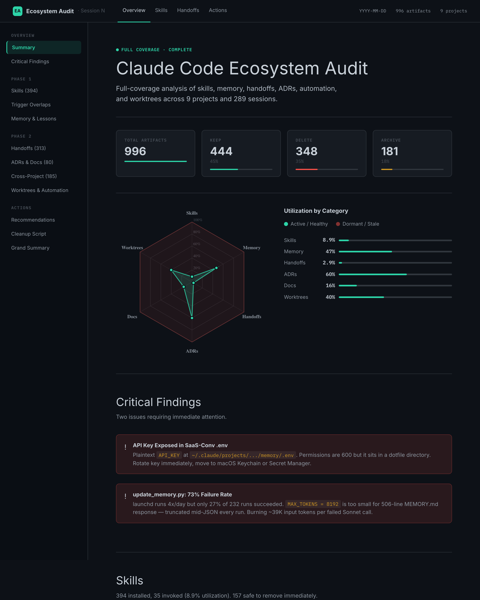

# Claude Code Ecosystem Hygiene

Ten complementary skills across three tracks. The **Claude-ecosystem track** (5 plugins) audits, measures, cleans, keeps consistent, and curates the context budget of your `~/.claude/` stack: identify what's HOT vs DORMANT, measure whether the HOT artifacts actually improve task outcomes, prune what doesn't pull its weight, keep project docs in sync with the lessons that supersede them, and trim the runaway skills-catalog token tax (`context-police`) without deleting a skill. The **project-quality track** (`test-effectiveness-auditor` + `repo-hygiene`) applies the same "measure don't guess, clean before you ship" discipline to your project itself — measure how many real bugs your test suite actually catches, and clean the repo (stray data files, hardcoded paths, client data) before each PR. The **authoring track** (`skill-portfolio-repo-placement-scan` + `claude-plugin-repo-ci-release`) maintains the skills and plugin repos you publish — decide which repo each authored skill belongs in (ADD / UPDATE-with-direction / CROSS-LINK), and wire CI validation + release-on-version-bump into plugin/marketplace repos so GitHub Releases never drift behind the shipped version.

[](LICENSE)
[](https://github.com/wan-huiyan/claude-ecosystem-hygiene/commits)
[](https://claude.com/claude-code)



## The audit → measure → clean → stay-consistent pipeline

```
┌─────────────────┐   ┌──────────────────┐   ┌────────────────┐   ┌───────────────────┐
│ ecosystem-audit │──▶│ claude-code-ab-  │──▶│ memory-hygiene │──▶│ doc-freshness-    │
│                 │   │ harness          │   │                │   │ reverse-lint      │
│ which artifacts │   │ do the HOT ones  │   │ prune what the │   │ catch project     │
│ are HOT vs      │   │ actually improve │   │ harness showed │   │ docs that still   │
│ DORMANT?        │   │ task outcomes?   │   │ adds no value  │   │ contradict the    │
│                 │   │                  │   │                │   │ new lessons       │
│ minutes, $0     │   │ 30min–3hrs, $10+ │   │ minutes, $0    │   │ event-driven, $0  │
└─────────────────┘   └──────────────────┘   └────────────────┘   └───────────────────┘
```

Reference counts are a starting point, not a verdict. `ecosystem-audit` catches DORMANT artifacts cheaply. But a HOT artifact might still be noise — it gets touched and adds nothing. Only the A/B harness can separate "HOT and useful" from "HOT and ritual." When ≥5 tasks show no outcome change under ablation, `memory-hygiene` has a concrete signal to consolidate or delete. Finally, `doc-freshness-reverse-lint` watches memory-file edits for new "don't X" rules and surfaces project docs that still recommend X — the step that prevents your freshly-corrected lessons from being silently undone by stale research notes.

## What's Inside

| Plugin | Stage | What it does |
|--------|-------|--------------|
| [`ecosystem-audit`](plugins/ecosystem-audit/) | **Audit** | Full-coverage audit across 9 artifact categories (skills, memory, handoffs, ADRs, plans, reviews, findings, tasks, worktrees), scored on 6 radar axes — the four `docs/` categories roll up into one **Docs** axis. Parses JSONL session logs for real skill invocation data. Produces interactive HTML report with radar chart and prioritized P0/P1/P2 cleanup actions. |
| [`context-police`](plugins/context-police/) | **Curate (context budget)** | Patrol the token cost of a runaway skills/agents catalog (injected every turn **and into every subagent**, paid `×N` on fan-out). Measure the per-turn / per-subagent overhead, trim it per-project (`skillOverrides`) or globally (`disable-model-invocation: true`) **without deleting a single skill**, and emit an interactive HTML recap of exactly what got hidden and why. Fixes the root cause `ecosystem-audit` surfaces: most catalog bloat is *episodic lessons mis-stored as force-loaded skills* — curate them out by description intent. (The tempting alternative, an on-demand retrieval hook, was tested to ground and **killed** by a base-rate wall: precision-when-firing <0.5% for both keyword *and* embedding gates.) Bundled from [`wan-huiyan/context-police`](https://github.com/wan-huiyan/context-police). |
| [`ab-harness`](plugins/ab-harness/) | **Measure** | Counterfactual A/B + layered-ablation harness. Runs each task twice (setup-ON vs setup-OFF) or strips one layer at a time from a full baseline, then reports turns, tool calls, cost, and pitfall-keyword hits. **Heavyweight: $10–$80, 30min–3hrs.** Pair with the audit to turn reference-count signals into actual quality measurements. |
| [`memory-hygiene`](plugins/memory-hygiene/) | **Clean** | Deep audit of the persistent knowledge stack: MEMORY.md bloat (200-line threshold), axioms (Cowan cap of 12), lessons deduplication, ADR integrity (MADR 4.0), tier-placement violations, session compression backlog. Grounded in cognitive science (Cowan 2001) and LLM research (Liu et al. 2024). |
| [`doc-freshness-reverse-lint`](plugins/doc-freshness-reverse-lint/) | **Stay consistent** | Event-driven PostToolUse hook + weekly cron that catches project `docs/` contradicting the lessons that supersede them. When you add "don't sort by p-value" to `lessons.md`, the hook greps `docs/research/**` for literal matches and surfaces them as candidate stale claims — file:line only, never auto-edits. Conservative guardrails (explicit negation, multi-token phrase, one phrase per rule, silent on zero hits) prevent false positives on qualified content. |
| [`test-effectiveness-auditor`](plugins/test-effectiveness-auditor/) | **Measure (project tests)** | Quantitatively answers "how many bugs do our tests actually catch?" Mines `docs/findings/`, `docs/issues/`, and git log fix commits, then for each incident checks out the pre-fix SHA in a temp worktree, runs the project's test command, and classifies as `caught` / `gap_testable` / `gap_hard` / `unrunnable`. Sibling 'measure' tool to `ab-harness` — ab-harness measures the Claude stack, this measures your project's own tests. Read-only, never auto-writes tests. Bundled from [`wan-huiyan/test-effectiveness-auditor`](https://github.com/wan-huiyan/test-effectiveness-auditor). |
| [`repo-hygiene`](plugins/repo-hygiene/) | **Clean (project repo)** | Pre-PR checklist that catches the repo-level mistakes that cost hours later: data files committed to git (`.csv`/`.db`/`.parquet`), hardcoded `/Users/` paths, tracked runtime artifacts, branch-ownership confusion, internal docs drifting from deliverables, and **client data in public repos**. Every item came from a real incident. Run it before `gh pr create`, before merging, or at handover — the project-quality track's 'clean' tool, sibling to `test-effectiveness-auditor`. v1.2.0 adds item 10: when *reviewing/auditing* a repo, probe live CI + run the repo's own tests before eyeballing files. |
| [`green-gate-never-examined-the-case`](plugins/green-gate-never-examined-the-case/) | **Verify (a check itself)** | A check reported clean without examining the case it exists for — "green" meant "nothing ran". Five measured mechanisms: scope excludes the case (a disabled skill's over-cap description reporting `over: False`); malformed input succeeds trivially; the error lands on a channel nobody reads (`git diff A...B` across unrelated histories exits 128 with empty stdout); a plumbing default kills one input (a depth-1 checkout halved a two-source gate — 26 claimed versions on the runner vs 28 locally, green either way); and the guard fires, is acted on correctly, and the damage still stands. The test is two clauses: make it fail on purpose once, and check what the failure already cost before clearing it. Complements `test-effectiveness-auditor` — that measures a suite's catch rate over history, this is about one check that cannot fail on its own case. |
| [`skill-portfolio-repo-placement-scan`](plugins/skill-portfolio-repo-placement-scan/) | **Author (placement)** | Scan a portfolio of authored skills and produce, per target repo, a precise list of which skills to ADD, which to UPDATE (with drift direction), and which to CROSS-LINK rather than copy. Per-repo function-level inclusion bars, portfolio deduplication (never recommend a skill already homed elsewhere), and a `version`/`last_verified` divergence check. Decides *placement*; run before `skill-portfolio-audit` (which audits quality). Never mutates — emits a recommendation report. |
| [`claude-plugin-repo-ci-release`](plugins/claude-plugin-repo-ci-release/) | **Author (CI/release)** | Wire up CI validation + automatic release-cutting for a Claude Code plugin/marketplace repo: a structure validator that runs on every PR/push, and a release-on-version-bump job that cuts a GitHub Release whenever `VERSION` changes — plus the bundled `validate_plugins.py` and workflow templates. Use when a plugin repo has no CI, or when its GitHub Releases have drifted behind the shipped version. |

> **Moved:** `skill-trigger-eval-subprocess-blindness` lived here in v1.0.0 but has been
> relocated to [`wan-huiyan/claude-skill-authoring`](https://github.com/wan-huiyan/claude-skill-authoring)
> where it sits alongside other skill-authoring tools. Update your install if you had it.

## Quick Start

```
you: i've been using claude code for a couple months and my ~/.claude folder
     feels bloated. can you audit and tell me what to clean up?

claude: *triggers ecosystem-audit*
        → parses 291 session JSONL files → 35 skills invoked out of 394 installed
        → checks memory via memory-hygiene thresholds → MEMORY.md 506 lines (bloated)
        → classifies 313 handoffs → 167 worktree duplicates identified
        → generates interactive HTML report with radar chart
        → writes cleanup script as P0 action

you: *opens docs/handoffs/ecosystem_audit_report.html*
     sees 8.9% skill utilization, 147 niche-dormant skills safe to uninstall.
     wonders: of the 35 invoked skills, which ones actually improve answers?

claude: *triggers ab-harness*
        → validates CLAUDE_CONFIG_DIR=/tmp/claude-empty probe
        → runs 3 hand-picked tasks twice each on setup-ON vs setup-OFF
        → mines session JSONLs for turns, cost, pitfall keywords
        → on n=3: setup prevented 1 of 3 pitfalls (33%), no turn savings
        → recommends layered ablation next for per-layer attribution

you: ok, now i know which layers earn their keep. what do i actually delete?

claude: *triggers memory-hygiene*
        → consumes the ranked layer-contribution list from the harness
        → flags the 8 zero-Δ layers as consolidation candidates
        → applies Cowan cap, MEMORY.md 200-line threshold, lesson dedup
```

## Installation

### Install all nine (recommended)

```bash
claude plugin marketplace add wan-huiyan/claude-ecosystem-hygiene
claude plugin install ecosystem-audit@claude-ecosystem-hygiene
claude plugin install context-police@claude-ecosystem-hygiene
claude plugin install ab-harness@claude-ecosystem-hygiene
claude plugin install memory-hygiene@claude-ecosystem-hygiene
claude plugin install doc-freshness-reverse-lint@claude-ecosystem-hygiene
claude plugin install test-effectiveness-auditor@claude-ecosystem-hygiene
claude plugin install repo-hygiene@claude-ecosystem-hygiene
claude plugin install skill-portfolio-repo-placement-scan@claude-ecosystem-hygiene
claude plugin install claude-plugin-repo-ci-release@claude-ecosystem-hygiene
```

### Install individually via git

```bash
git clone https://github.com/wan-huiyan/claude-ecosystem-hygiene.git /tmp/ceh
cp -r /tmp/ceh/plugins/ecosystem-audit ~/.claude/skills/
cp -r /tmp/ceh/plugins/context-police ~/.claude/skills/
cp -r /tmp/ceh/plugins/ab-harness ~/.claude/skills/
cp -r /tmp/ceh/plugins/memory-hygiene ~/.claude/skills/
cp -r /tmp/ceh/plugins/doc-freshness-reverse-lint ~/.claude/skills/
cp -r /tmp/ceh/plugins/test-effectiveness-auditor ~/.claude/skills/
cp -r /tmp/ceh/plugins/repo-hygiene ~/.claude/skills/
cp -r /tmp/ceh/plugins/skill-portfolio-repo-placement-scan ~/.claude/skills/
cp -r /tmp/ceh/plugins/claude-plugin-repo-ci-release ~/.claude/skills/
```

> **`doc-freshness-reverse-lint` needs a hook** to trigger automatically. After
> install, follow the `PostToolUse` hook wiring in its
> [README](plugins/doc-freshness-reverse-lint/README.md#hook-wiring-required-for-event-driven-mode)
> and put it in your `~/.claude/settings.json`. **Print the installed path first
> and paste that** — a hook `command` is a literal string, and a plugin install
> puts the dispatcher under `~/.claude/plugins/cache/…`, not under
> `~/.claude/skills/…`, so a hardcoded `~/.claude/skills/` path makes the hook
> fail silently. Without the hook, it still runs on demand via the weekly audit
> script — you just lose the event-driven surfacing.

> **Note:** `memory-hygiene` is also available as a standalone repo at
> [`wan-huiyan/memory-hygiene`](https://github.com/wan-huiyan/memory-hygiene),
> `test-effectiveness-auditor` is also available standalone at
> [`wan-huiyan/test-effectiveness-auditor`](https://github.com/wan-huiyan/test-effectiveness-auditor),
> and `context-police` is also available standalone at
> [`wan-huiyan/context-police`](https://github.com/wan-huiyan/context-police).
> Installing from either source yields the same skill. Use this bundle if you want them
> alongside the audit and A/B harness; use the standalone repos if you only want one.

## How They Fit Together

```
┌─────────────────────────────────────────────────────────────┐
│  ecosystem-audit               Scope: the WHOLE ecosystem   │
│    ├─ parses JSONL session logs for skill usage             │
│    ├─ calls memory-hygiene thresholds inline                │
│    ├─ scans handoffs, ADRs, worktrees, automation           │
│    └─ produces interactive HTML with radar chart            │
├─────────────────────────────────────────────────────────────┤
│  ab-harness        Scope: outcome measurement   │
│    ├─ CLAUDE_CONFIG_DIR clean-env mechanism                 │
│    ├─ binary A/B (setup-ON vs setup-OFF)                    │
│    ├─ 12-cell layered ablation (strip one layer at a time)  │
│    └─ ranked contribution list feeds back into pruning      │
├─────────────────────────────────────────────────────────────┤
│  memory-hygiene                Scope: persistent knowledge  │
│    ├─ MEMORY.md bloat (>200 lines = truncation risk)        │
│    ├─ axioms cap (Cowan 2001 = 12 items max)                │
│    ├─ lessons dedup + tier placement                        │
│    ├─ ADR integrity (MADR 4.0 compliance)                   │
│    └─ codebase contradiction detection                      │
├─────────────────────────────────────────────────────────────┤
│  doc-freshness-reverse-lint    Scope: project docs/ ↔ memory│
│    ├─ PostToolUse hook on lessons.md / axioms.md / feedback │
│    ├─ extracts negated "don't X" phrase                     │
│    ├─ greps docs/{research,decisions,findings,runbooks}/    │
│    ├─ surfaces candidate stale claims via hookOutput        │
│    └─ weekly cron audit as safety net                       │
├─────────────────────────────────────────────────────────────┤
│  test-effectiveness-auditor    Scope: your project's tests  │
│    ├─ mines docs/findings + git log fix|bug|revert|hotfix   │
│    ├─ checks out pre-fix SHA in temp worktree per incident  │
│    ├─ runs the project test command, parses pass/fail       │
│    ├─ classifies caught / gap_testable / gap_hard / unrunna │
│    └─ Method 2: gh actions / gcloud builds CI history       │
├─────────────────────────────────────────────────────────────┤
│  repo-hygiene                  Scope: your project's repo   │
│    ├─ tracked data files (.csv/.db/.parquet) + .gitignore   │
│    ├─ hardcoded /Users/ paths + runtime artifacts           │
│    ├─ branch ownership + internal docs vs deliverables      │
│    └─ client data in public repos — pre-PR / pre-handover   │
└─────────────────────────────────────────────────────────────┘
```

Run `ecosystem-audit` to see the big picture of your `~/.claude/`. Point `ab-harness` at the HOT artifacts it flagged to see which ones actually change task outcomes. When the harness or the audit flags memory issues, drop into `memory-hygiene` for concrete fixes. Once a new lesson lands, `doc-freshness-reverse-lint` catches any project docs that still recommend the retracted approach — closing the loop so future sessions don't re-learn the wrong thing. Separately, when you want the same "measure don't guess" rigor applied to your project's own automated tests, run `test-effectiveness-auditor` — it replays past bugs at pre-fix commits and tells you which ones the suite would have caught. And before each PR or handover, `repo-hygiene` sweeps the project repo for the cleanup mistakes that cost hours later — stray data files, hardcoded paths, and client data in public repos. For skill-authoring tooling (including the subprocess-blindness diagnostic), see [`claude-skill-authoring`](https://github.com/wan-huiyan/claude-skill-authoring).

## What to do with A/B harness results

The A/B harness emits a ranked layer-contribution list — e.g., on one real run
(see [`plugins/ab-harness/examples/layered_ablation_example.md`](plugins/ab-harness/examples/layered_ablation_example.md))
only 2 of 10 ablated layers had measurable pitfall-prevention loss at n=1.
The other 8 were zero-delta strips. That's the signal `memory-hygiene` is
designed to consume:

- **Δ pitfalls = 0 AND Δ cost > 0 when stripped** → layer adds cost without catching anything on the measured task set. Candidate for consolidation.
- **Δ pitfalls < 0** → layer earned its keep. Keep (or invest more in it).
- **Δ pitfalls = 0 AND Δ cost ≤ 0 when stripped** → layer costs nothing to keep but didn't provably help either. Leave alone, re-evaluate next audit.

Remember the limitations: n=1 rankings tie within noise below the top two slots, and the task set upward-biases pitfall-prevention. Use the harness as evidence for pruning decisions, not proof.

## What You Get

When you ask Claude to audit your ecosystem, you get:

- **Markdown report** at `docs/handoffs/ecosystem_audit_report.md` with summary tables and cleanup actions
- **Interactive HTML report** at `docs/handoffs/ecosystem_audit_report.html` featuring:
  - Radar chart showing health % across 6 axes (skills, memory, handoffs, ADRs, docs, worktrees)
  - Sortable tables per category
  - Priority-coded action cards (P0 red, P1 amber, P2 blue)
  - Ready-to-run cleanup script in a code block
- **Cleanup script** ready to paste into your terminal

## Without These Skills vs With

| Question | Without | With |
|----------|---------|------|
| "Which skills am I actually using?" | `ls ~/.claude/skills \| wc -l` — you get the install count, not usage | Parse JSONL logs → "35 invoked out of 394 in last 30 days (8.9%)" |
| "Is my memory bloated?" | Open MEMORY.md, eyeball it | `wc -l` against thresholds: bloated >200, target ~40 |
| "Are my handoffs stale?" | Manually scan `docs/handoffs/` | Classify as Current/Historical/Orphaned with counts per project |
| "Are my worktrees healthy?" | `git worktree list` — see paths, not staleness | Lifecycle score (EXPECTED / ACCEPTABLE / NEEDS_CLEANUP / ABANDONED) |
| "Do our project's tests actually catch bugs?" | `pytest --cov` — coverage % is a proxy, not catch rate | Replay 5–10 documented bugs at pre-fix commits; report N caught / M gaps with a prioritised gap backlog |

## Decision Criteria

Thresholds in **bold** are grounded in published sources.
Thresholds in *italic* are practitioner heuristics — adjust for your domain.

| Metric | Threshold | Source |
|--------|-----------|--------|
| MEMORY.md bloat | **>200 lines = truncation risk** | Claude Code platform limit |
| Axioms count | **12 items max** | [Cowan (2001)](https://doi.org/10.1017/S0140525X01003922) — working memory capacity |
| Position decay in long context | **>30% accuracy loss mid-context** | [Liu et al. (2024) TACL](https://arxiv.org/abs/2307.03172) |
| Skill utilization threshold | *<10% = worth pruning* | Practitioner heuristic |
| Worktree "abandoned" | *unmerged + >14 days* | Practitioner heuristic |
| Session compression | *>30 days + >50 lines + unreferenced* | memory-hygiene convention |

## Limitations

- **Session log scope.** Only skills invoked via the `Skill()` tool show up in the usage analysis. Skills invoked through slash commands (`/causal-impact-campaign`) appear the same as interactive triggers, but anything bypassing the Skill tool (e.g., direct file reads of a SKILL.md) won't be counted.
- **No monthly automation.** The audit runs on demand. There's no built-in cron — if you want it scheduled, combine with the `schedule` skill.
- **Worktree lifecycle scoring is age-based.** A "hot" worktree on a 20-day-old branch that's actively being committed to gets scored as ABANDONED. The metric favors conventional workflows.
- **HTML template styling is opinionated.** The dark terminal theme (GitHub-dark background, Fira Code headings, teal accent) is intentional. Rewrite the template if you want a different aesthetic.
- **Not a replacement for `schliff:doctor` or individual skill tooling.** This bundle covers ecosystem-level breadth. For per-skill structural quality, pair with [schliff](https://github.com/Zandereins/schliff).

## Related Skills & Sibling Repos

Two siblings are load-bearing, not just adjacent:

- **[session-handoff](https://github.com/wan-huiyan/session-handoff)** — The capture end of the pipeline, and a two-way dependency of this bundle. It doesn't just create the handoff docs that `ecosystem-audit` classifies: session-handoff **Phase 4 invokes `doc-freshness-reverse-lint`** at end-of-session (step 24 runs `reverse_lint.py` on every memory file touched; step 24b runs the skill-freshness audit when a SKILL.md was edited — that script ships with **session-handoff itself**, not with this bundle, so step 24b works normally; this bundle simply does not implement the equivalent mechanism 3), and **`memory-hygiene` v3.3 is the source-of-truth for the 7-bucket `docs/` taxonomy that session-handoff dispatches output into** (§1j) — while memory-hygiene in turn **invokes session-handoff's `label_audit.py`** for label-table integrity (§1i). Both directions degrade gracefully when the other side isn't installed, but you get the full loop only with both.
- **[token-torch](https://github.com/wan-huiyan/token-torch)** — The measurement node: a local usage/cost dashboard that parses the same session JSONLs and **quantifies whether the hygiene pays off** — per-turn catalog overhead, subagent fan-out cost, cache-read vs fresh-input token split. It already consumes `context-police`'s output, so a curation pass shows up as a measurable before/after drop in the dashboard rather than a vibe.

**Pipeline:** `session-handoff` captures each session's output into the canonical `docs/` taxonomy → `memory-hygiene` prunes the persistent knowledge that accumulates there → `context-police` curates the always-injected skills catalog down to what earns its tokens → `token-torch` measures the impact, closing the loop with numbers.

Adjacent tooling:

- **[schliff](https://github.com/Zandereins/schliff)** — Per-skill structural quality scoring on 7 dimensions. Runs after ecosystem-audit identifies dormant skills to assess if they're worth keeping.
- **[skill-portfolio-audit](https://github.com/wan-huiyan/skill-portfolio-audit)** — Portfolio-wide README/badge standardization. Run after cleanup to polish remaining skills.
- **[skill-sync](https://github.com/wan-huiyan/skill-sync)** — Keeps published skills in sync with their GitHub repos.
- **[skill-anonymizer](https://github.com/wan-huiyan/skill-anonymizer)** — Scans skills for client-specific data and anonymizes them for safe public sharing — the skill-level companion to `repo-hygiene`'s repo-level "client data in public repos" check.

### Shared internals contract

Every repo in this family depends on Claude Code internals — transcript JSONL schema, `~/.claude/projects/` layout, the MEMORY.md 200-line/25KB load limit, hook payload contracts, settings precedence, skill-listing budget defaults. These assumptions used to be hardcoded independently in each repo, with different staleness. They now live in one versioned reference: [`contracts/claude-code-internals.md`](contracts/claude-code-internals.md), each entry tagged docs-backed / observed / reverse-engineered with a verified-as-of date and re-verification steps. Run [`contracts/probe_internals.py`](contracts/probe_internals.py) against a live `~/.claude` to get an OK / DRIFT / UNKNOWN report on the locally-checkable subset. When a Claude Code release moves the ground, update the contract first, then propagate to token-torch, context-police, memory-hygiene, session-handoff, and this bundle's plugins.

## Quality Checklist

<details>
<summary>What this bundle guarantees</summary>

- [x] **No client data in any published artifact.** All examples use synthetic SaaS/retail domain names.
- [x] **Canonical plugin layout.** `marketplace.json` in `.claude-plugin/`, plugin manifests in `plugins/<name>/.claude-plugin/plugin.json`, source paths start with `./plugins/`.
- [x] **Per-plugin version tracking.** Each plugin has independent `version` in `plugin.json` and marketplace entry.
- [x] **Every skill description fits the skill-listing cap.** CI runs `.github/scripts/check_skill_descriptions.py` (vendored from [`context-police`](https://github.com/wan-huiyan/context-police)) — over `skillListingMaxDescChars` (1536) the harness keeps `full[:1535]` and appends an ellipsis, so every trigger phrase past the cut is silently dead. The same check runs *before* each `sync-*.yml` workflow pushes, so an upstream regression is blocked rather than reported. **Necessary, not sufficient:** under the cap means *not truncated*, not *guaranteed visible* — `skillListingBudgetFraction` (1% of context) is shared across every installed skill and collapses descriptions to bare names by usage rank when the whole listing is over budget.
- [x] **MIT licensed.** Free to fork, modify, and redistribute.
- [x] **Published thresholds are cited.** Cowan, Liu et al., and platform limits link to sources. Heuristics are labeled as such.
- [x] **HTML report is self-contained.** No external CDN dependencies, works offline after initial font load.
- [x] **JSONL parsing tested on 291 real sessions** (~35 skills, ~226 invocations, all projects).

</details>

## Version History

- **v1.11.0** (2026-08-11) — **NEW `green-gate-never-examined-the-case`: five ways a check reports clean without ever examining the case it exists for.** All five were measured in one session, which is the reason to treat them as a family. **(1) Scope excludes the case** — a description gate building `live = [s for s in skills if not s.disabled]` reported `over: False` for a **disabled** skill's 1,548-char description against a 1,536 cap; deactivating a thing deactivates its guard, and deactivation is when nobody looks. **(2) Malformed input succeeds trivially** — a test named for a corrupt base64 payload never reached the decode branch, because `%` falls outside the alphabet, the capture group matched empty, and `b64decode("")` returned cleanly. **(3) The error lands on a channel nobody reads** — `git diff --diff-filter=D --name-only a...b` across unrelated histories exits **128** with **empty stdout**, so `if [ -z "$(git diff …)" ]` reads a clean bill from a comparison that never ran; the two-dot form reports normally there, so the two fail in opposite directions. **(4) A plumbing default kills one input** — a gate unioning VERSION history with a README changelog was reduced to its changelog half by `actions/checkout@v4` without `fetch-depth: 0`: **26 claimed versions on the runner against 28 locally, green either way**, found on that gate's own introducing CI run by reading the step's output instead of its tick. **(5) The guard fires, is acted on correctly, and the damage still stands** — the worst and least visible, because every signal behaved properly: a release workflow filtered `paths: ['VERSION']`, a commit shipped v1.13.0 in the manifests while VERSION stayed 1.12.0 so the job **never ran**, the drift guard *did* go red on that very commit, and the human fix bumped to 1.14.0 — stepping **over** a value no push can ever cut now. Hence the framing: **a guard tells you a state is wrong; it does not tell you what that wrong state already cost.** The skill carries the two-clause test (make it fail on purpose once; check what the failure already cost before clearing it), a six-item review checklist, and a section on **baselining a gate that ships red** — one that cannot go green gets muted inside a week, and a muted gate looks like coverage — including the rule that a baseline must record what was **verified** rather than what was plausible, because a confident wrong note is what the next person trusts instead of re-checking. **This repo has instance 5's latent bug too**: `release.yml` here also filters `paths: ['VERSION']`. Checked rather than assumed — cost so far is **nil**, because VERSION and the workflow arrived in the same commit (`309d720`) and every version since v1.7.0 has a release. Bug present, damage none; the fix is not in this PR. Description deliberately trimmed to **674 chars**, about half its siblings, because this repo's listing is already over budget — it costs 713 chars and takes description survival from 76% to 71%.

- **v1.10.4** (2026-08-06) — **`doc-freshness-reverse-lint` v1.4.0: the skill could not reach its own scripts on a plugin install, and its hook would never have fired.** A plugin installs to `~/.claude/plugins/cache/<marketplace>/<plugin>/<version>/` and creates **neither** `~/.claude/skills/<plugin>/` **nor** a set `$CLAUDE_PLUGIN_ROOT` (that variable is usually unset in the shell a step actually runs in, and it points at the *calling* plugin's root, so it can never reach a sibling). Five invocations in `SKILL.md`, one in the plugin `README.md`, and one inside `scripts/hook_dispatch.sh` reached their target through the `~/.claude/skills/` root **alone**, so on the recommended install path every one of them missed. The failure is silent in both directions: the documented fallback is "log and continue", and a `settings.json` hook whose `command` string does not exist simply never produces output. **Fixed by resolving across all three roots before invoking** — `$CLAUDE_PLUGIN_ROOT/scripts/`, then `~/.claude/skills/<plugin>/scripts/`, then a `find` over the plugin cache. Four details are load-bearing and each came from a real defect: rank on the **version segment alone** (`awk -F/ '{print $(NF-2)"\t"$0}' | sort -V -k1,1`), because the marketplace name precedes the version in the path and a plain `sort -V` over whole paths would let `aaa-mkt/2.5.0` lose to `zzz-mkt/1.0.0`; use `find`, **not a shell glob**, because zsh fails a non-matching glob at expansion time, before `2>/dev/null` can apply; **guard before redirecting**, because `> "$OUT"` truncates the file before the command is exec'd and leaves a 0-byte file that reads as a real record; and report **"not found - tried &lt;paths&gt;"**, never a bare "not installed" — a failed lookup is not evidence about install state, and that exact wording has already been misread by a human as proof a skill was absent. `hook_dispatch.sh` additionally tries its **own directory first** (`reverse_lint.py` is its sibling), which is correct under every install method; the three roots are its fallback. Verified on this machine: from a copy outside the bundle the resolver picks `…/doc-freshness-reverse-lint/1.3.0/scripts/reverse_lint.py` over the co-installed `1.2.0`, and against an empty `$HOME` it prints the not-found line and exits 0. The hook-wiring instructions in both READMEs and `SKILL.md` now say **print the resolved path, then paste it**, with a warning to re-run after every upgrade because the cache path carries the version segment. Same bug class as [`session-handoff#13`](https://github.com/wan-huiyan/session-handoff/pull/13). **Also recorded, not fixed:** `skill_freshness_audit.py` (mechanism 3) **has never existed in this repo** — note this does *not* affect `session-handoff` Phase 4 step 24b, which resolves its own bundled copy and works normally — no commit in the history ever added it, and it is absent from both installed copies. Three places that implied it was runnable now say plainly that it is not bundled; the frontmatter and marketplace descriptions still advertise the mechanism and are left for a separate pass, because editing them moves the trigger surface the description-cap gate measures.
- **v1.10.3** (2026-08-05) — *(backfilled 2026-08-06; the release shipped without a version-history entry)* **`skill-portfolio-repo-placement-scan` v1.0.1: a "don't use for" list routed the reader to `skill-portfolio-audit`, a skill that does not exist** — not in this repo, not in any installed plugin, not under `~/.claude/skills`. The distinction the clause draws is worth keeping and was kept; only the dead name went. Description 1,304 → 1,278 chars (headroom 232 → 258), `--compare` reported 0 dropped / 0 narrowed / 5 triggers unchanged.
- **v1.10.2** (2026-08-05) — **Accuracy pass over v1.10.1, plus the gate re-vendored at upstream v2.2.1.** Four corrections, each re-measured rather than inherited. **(1) The "9 artifact categories" list named two categories the audit has never scanned.** Both READMEs listed `(… plans, reviews, worktrees, automation, provenance)`; `provenance` appears **zero** times in `ecosystem-audit/SKILL.md` and `automation` only inside an unrelated P0 example. The nine are **skills, memory, handoffs, ADRs, plans, reviews, findings, tasks, worktrees** — `SKILL.md`'s scoring section defines `Docs` as `plans + reviews + findings + tasks`, which is also why "9 categories" and the radar's "6 axes" were both correct and read as a contradiction: those four roll up into one `Docs` axis. Corrected in both READMEs and annotated in the v1.0.0 CHANGELOG entry that introduced it. **(2) `ecosystem-audit` v1.2.1 shipped in `d556709` with no CHANGELOG entry**, leaving a gap between v1.2.0 and v1.2.2; backfilled. **(3) The v1.10.1 note below said upstream `context-police` was still over cap and its fix unmerged.** [`context-police#6`](https://github.com/wan-huiyan/context-police/pull/6) has since merged as `eedad0f`; annotated in place rather than rewritten. **(4) `.github/scripts/check_skill_descriptions.py` re-vendored** from `context-police@eedad0f` (version **2.2.1**), whose `find_wrap_corruption()` no longer reports a bogus `BROKEN BY LINE-WRAP` on skills written `description: >-` — measured over `~/.claude/plugins/cache`, v2.2.0 reports 11 wrap hits and v2.2.1 reports 7, the four dropped all false positives. The vendoring note is now machine-strippable (`--8<--` markers) so a parity digest can be pinned, and records that `2.2.0`/`2.2.1` are context-police *plugin* versions, not git tags. **The cap arithmetic did not change** between v2.2.0 and v2.2.1 — `desc_chars - (MAX_DESC_CHARS - 1)` was already in `4dc1a62` — so no "N chars discarded" figure in this repo moves. No skill description changed; all nine still exit the gate 0, listing total unchanged at 10,435 chars.
- **v1.10.1** (2026-08-04) — **Skill-listing description cap: two skills were over it, and CI now blocks regressions before they land.** Claude Code injects each model-invocable skill's `name + description` into context every turn and caps the entry at `skillListingMaxDescChars` (default 1536); over the cap it keeps `full[:1535]` and appends an ellipsis — it truncates mid-word, with no warning. A description *is* trigger text, so anything past char 1535 is already dead, and the dead tail is `len(desc) - 1535` — one char more than the naive `len(desc) - 1536`. **`ecosystem-audit` was 1694 chars (159 invisible) since its very first commit** (`bd256ab`, 2026-04-17) — the dead tail was the entire proactive-invocation instruction ("Use this proactively whenever the user describes ANY ecosystem-level symptom, even if they don't explicitly ask for an 'audit'"), which had therefore never fired. Retrimmed to **1495** (41 under cap), keeping **every** quoted trigger phrase and the `schliff:doctor` / `memory-hygiene` positioning that disambiguates it from its siblings, and adding `lessons` / `feedbacks` / `ADRs` / `docs` / `"give me a cleanup script"` / `"regenerate my stale audit"`. Coverage measured against the *truncated* baseline the model actually saw, with the harness committed at `plugins/ecosystem-audit/scripts/score_trigger_coverage.py` so the figures re-run from a clean checkout: positive-prompt coverage 0.497 → 0.520, negative 0.192 → 0.204, separation 0.305 → 0.316, 4 better / 6 same / 0 worse on positives (and 4/6/0 again with the stopword filter off). **`context-police` was 1636 chars (101 invisible)** — re-breached by the 2026-07-06 upstream sync `28236bf` (it had been fixed at 1349 by the 2026-06-22 sync); the dead tail was the history footnote. Retrimmed to **1454** (82 under cap) by cutting prose only. **This bundle's `context-police` is a mirror, and it does not self-heal:** `sync-context-police.yml` clones upstream's *default* branch, and upstream `main` @ `47a24fd` is still 1,636 chars (measured 2026-08-04; the 1,533-char fix is on the open PR [`context-police#6`](https://github.com/wan-huiyan/context-police/pull/6)). So until that merges the sync does **not** reconcile — with this release's hardening in place it **fails and pushes nothing**, leaving the trim intact but freezing the mirror; without it, it would have overwritten the trim. **[Updated 2026-08-05: `context-police#6` merged as `eedad0f`. Upstream `main` is now 1,533 chars, under the cap, so the sync now passes the gate and reconciles — the next run replaces this bundle's locally-retrimmed 1,454-char mirror with upstream's 1,533. Both are under cap; the mirror is upstream's payload, not a second source of truth.]** **New CI gate:** `.github/scripts/check_skill_descriptions.py` (vendored from [`wan-huiyan/context-police`](https://github.com/wan-huiyan/context-police) at upstream v2.2.0) runs on every PR and push — exit 1 on any skill over cap or on hyphen tokens broken by a folded-scalar re-wrap, `--triggers` prints the phrases truncation would destroy, `--compare OLD NEW` diffs the trigger surface for phrases a coverage metric cannot see. **And the same check now runs inside all three `sync-*.yml` workflows immediately before their `git push`** — the ci.yml gate alone fires on `push: main`, i.e. after a bad bundle has already landed, which is reporting, not prevention. Arriving just in time: `doc-freshness-reverse-lint` v1.3.0 (`da5cd1a`, merged in #13 at `502555b` — two merges back on `main`, with #15 `af97fee` in between) grew its description from 1193 to **1465** — 71 chars from the cliff, and nothing would have told anyone. **Under the cap is not the same as visible:** `skillListingBudgetFraction` (1% of context) is a second, shared limit — this bundle's nine descriptions total 10,435 chars against an 8,000-char listing budget at 200k context, and that budget is shared with every *other* skill installed, so the collapse-to-bare-name behaviour (usage-ranked, not length-ranked) still applies. Out of scope for this release; the gate reports it and does not fail on it.
- **v1.10.0** (2026-07-03) — **`context-police` synced to v2.0.0 + new shared internals contract + README ecosystem map.** Retroactive note: two upstream sync commits after the v1.9.0 release bumped the bundled `context-police` from v1.8.0 to v2.0.0 without a version-history entry — this entry records that drift; the v1.9.0 entry below describes v1.8.0 as shipped at the time. **New `contracts/claude-code-internals.md`:** a single versioned reference consolidating the Claude Code internal assumptions the whole tool family relies on (transcript JSONL location + subagent layout, `message.usage` token fields, MEMORY.md 200-line/25KB load limit, skills/`skillOverrides`/skill-listing-budget defaults, hook events + `hookSpecificOutput.additionalContext`, settings precedence), each tagged docs-backed / observed / reverse-engineered with verified-as-of dates — plus `contracts/probe_internals.py` (stdlib, `--json`) that reports OK / DRIFT / UNKNOWN per locally-checkable assumption. Consumed by token-torch, context-police, memory-hygiene, session-handoff, and this bundle's plugins. **README ecosystem map updated:** added [`token-torch`](https://github.com/wan-huiyan/token-torch) as the measurement node (quantifies whether the hygiene pays off; already consumes context-police output), promoted [`session-handoff`](https://github.com/wan-huiyan/session-handoff) from passing reference to load-bearing sibling (it invokes `doc-freshness-reverse-lint` in Phase 4; `memory-hygiene` v3.3 defines the 7-bucket `docs/` taxonomy it dispatches to and invokes its `label_audit.py`), and added the capture → prune → curate → measure pipeline paragraph.
- **v1.9.0** (2026-06-05) — **Added `context-police` v1.8.0** as the context-budget "curate" tool — the fix for the root cause `ecosystem-audit` surfaces. Measures the skills/agents-catalog token tax (paid every turn + into every subagent, `×N` on fan-out), trims it per-project (`skillOverrides`) or globally (`disable-model-invocation: true`) without deleting any skill, and emits an interactive HTML recap. Ships the actionable flip applier (`scripts/apply_disable_model_invocation.py`) + the genericized retrieval-pilot harness (`scripts/pilot/`) that proved a retrieval hook **cannot** replace force-load — a base-rate wall kills both keyword and embedding gates (precision-when-firing <0.5%). Bundled from the standalone [`wan-huiyan/context-police`](https://github.com/wan-huiyan/context-police) and kept in sync by `.github/workflows/sync-context-police.yml`. Bundle now 9 plugins. README intro, What's-Inside table, and install commands updated.
- **v1.8.0** (2026-06-01) — **Added the authoring track (2 plugins): `skill-portfolio-repo-placement-scan` v1.0.0 and `claude-plugin-repo-ci-release` v1.0.0.** Placement-scan maps a portfolio of authored skills to target repos (ADD / UPDATE-with-direction / CROSS-LINK) using per-repo function bars + dedup + version-divergence checks; ci-release wires structure-validation + release-on-version-bump GitHub Actions into plugin/marketplace repos. **`repo-hygiene` bumped to v1.2.0** — folded in the repo-review pattern (item 10): probe live CI (`gh run list`) + run the repo's own tests *before* eyeballing files, with the malformed-semver (`.1.9.1`) check. Bundle now 8 plugins across three tracks (Claude-ecosystem 4 + project-quality 2 + authoring 2). README intro, What's-Inside table, and install commands updated.
- **v1.7.0** (2026-05-29) — **Added `repo-hygiene` v1.1.0** as the project-quality track's "clean" tool — sibling to `test-effectiveness-auditor` (which measures the same repo's tests). Pre-PR / pre-handover checklist that catches repo-level mistakes that cost hours later: data files committed to git (`.csv`/`.db`/`.parquet`), hardcoded `/Users/` paths, tracked runtime artifacts, branch-ownership confusion, internal docs drifting from deliverables, and **client data in public repos**. Bundle now 6 plugins (Claude-ecosystem track 4 + project-quality track 2). README "two tracks" framing, What's-Inside table, fit-together diagram, and install commands updated. Also added a `skill-anonymizer` cross-link (the skill-level companion to `repo-hygiene`'s repo-level client-data check).
- **v1.6.0** (2026-04-25) — **ecosystem-audit bumped to v1.2.0** with two changes motivated by v3 layered-ablation findings (240 cells, n=15). **Change A:** T1 tier now requires A/B evidence (`ab_evidence.delta_vs_noop_se >= 1.0`) or an explicit `reference-count-only` disclaimer — "frequently referenced" no longer equals T1, following the v3 finding that `lessons.md` (highest-ref layer) had Δ within noise while `skills+plugins` (C4) dominated. `score_health.py` emits `t1_warnings` for undocumented T1 layers. **Change B:** each skill-type layer now carries `latency_cost` and `trigger_surface_match` annotations; new report section "Skills with mismatched trigger surface" lists high-ref / low-A/B-signal skills (the v3 pattern that adds latency without pitfall benefit). Recommendation engine updated to mine session prompts for task-type distribution before suggesting skills. Plugin adds `README.md`, `CHANGELOG.md`, and standalone `marketplace.json`. Two new evals (IDs 8–9) covering T1 warning and mismatch explanations. Cross-references ab-harness v1.2.0 §"Noise floor" and §"C11 saturation."
- **v1.5.0** (2026-04-24) — **Added `test-effectiveness-auditor` v1.0.0** as the project-quality measurement track. Sibling 'measure' tool to `ab-harness`: ab-harness measures whether your Claude Code stack improves outcomes, this measures whether your project's own automated tests catch bugs. Mines `docs/findings|issues|diagnostics|audits` + git log fix commits, replays each incident at pre-fix SHA in a temp worktree, runs the project test command, classifies caught / gap_testable / gap_hard / unrunnable. Method 2 secondary: classify CI history (gh actions / gcloud builds). Bundled from [`wan-huiyan/test-effectiveness-auditor`](https://github.com/wan-huiyan/test-effectiveness-auditor) via `sync-test-effectiveness-auditor.yml` (cron Mon 09:05 UTC, repository_dispatch on `test-effectiveness-auditor-updated`). README updated to call out the new "two tracks" framing — Claude-ecosystem track (4 plugins) and project-quality track (1 plugin).
- **v1.4.0** (2026-04-24) — **Naming cleanup.** Marketplace renamed `wan-huiyan-ecosystem-hygiene` → `claude-ecosystem-hygiene` (matches repo). Plugin `claude-code-ab-harness` → `ab-harness` (dropped redundant `claude-code-` prefix; now parallel with the other three plugin names). Real-name references (`Huiyan Wan`) replaced with the `wan-huiyan` GitHub handle across marketplace/plugin manifests and one SKILL.md frontmatter. **Breaking:** existing installs referring to `@wan-huiyan-ecosystem-hygiene` or `claude-code-ab-harness@...` will need to be reinstalled with the new names. `ab-harness` plugin bumped to v1.2.0 to signal the rename.
- **v1.3.0** (2026-04-24) — **Added `doc-freshness-reverse-lint` v1.0.0** as the "stay-consistent" step. Event-driven PostToolUse hook on `lessons.md`/`axioms.md`/`feedback_*.md` + weekly cron safety net. Catches project `docs/` that still recommend approaches the user has since retracted in memory. Conservative guardrails (explicit negation, multi-token phrase, one phrase per rule, silent on zero hits) validated against 93 real negation rules × 43 docs → 0 false positives on a live causal-impact project.
- **v1.2.0** (2026-04-24) — **Added `ab-harness` v1.1.0** to complete the audit → measure → clean pipeline. The harness is heavyweight ($10–$80, 30min–3hrs) but converts `ecosystem-audit`'s reference-count signals into real outcome measurements, and produces a ranked layer-contribution list that `memory-hygiene` can consume. Includes sanitized example outputs from the 2026-04-21 binary A/B (27 vs 30 turns, 1 of 3 pitfalls prevented) and the 2026-04-23 layered ablation (skills+plugins −2/3 and lessons.md −1/3 were the only non-zero-Δ strips). Marketplace copy is canonical for this plugin — no cross-repo sync job.
- **v1.1.0** (2026-04-17) — **ecosystem-audit bumped to v1.1.0** (memory-hygiene v3.0 alignment): Memory subagent now delegates to memory-hygiene Phase 1 (single source of truth; prevents drift); T1.5 tier coverage added (`~/.claude/templates/phase_*.md` + `.claude/rules/phase-*.md` with `paths:` glob validity); axiom health now checks classification (Universal/Role/Phase), not just raw count vs Cowan cap; staleness expanded from 2 to 4 signals + agency-aware detection via `user_role.md`; radar chart renders `N/A` with hatched pattern when sub-checks can't compute (no fabricated scores); Memory weighting rebalanced to 6 inputs (25/15/15/10/20/15). Also moved `skill-trigger-eval-subprocess-blindness` to [`claude-skill-authoring`](https://github.com/wan-huiyan/claude-skill-authoring); it was out of scope for this marketplace.
- **v1.0.0** (2026-04-16) — Initial bundle release. Contains ecosystem-audit v1.0.0, memory-hygiene v3.0.0, skill-trigger-eval-subprocess-blindness v1.0.0.

## License

MIT. See [LICENSE](LICENSE).
